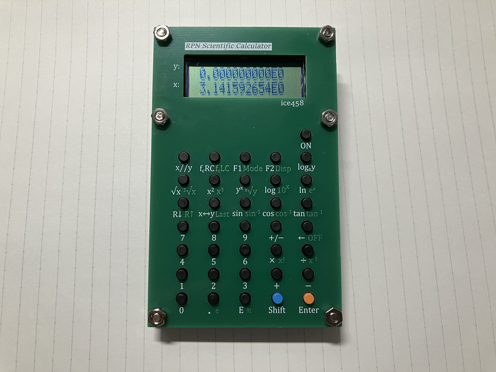

# RPN Scientific Calculator
RPN Scientific Calculator with PIC32CM2532LE00048.  
Reverse Polish notation with 4-element stack.  
This calculator uses a proprietary decimal floating point library to perform calculations.  
This project was created using MPLAB X IDE v6.20, XC32 v4.35, and MCC v5.50.  
For more information, please visit [this site.](https://ice458.wordpress.com/rpn%e9%96%a2%e6%95%b0%e9%9b%bb%e5%8d%93/)

  

## License

This project is licensed under the MIT License. See the [LICENSE](LICENSE) file for details.

## Notice Regarding Third-Party Code

Please note that the copyright of the files contained in the directories [src/packs](src/packs) and [src/config](src/config) does not belong to ice458. These files include code that is subject to third-party licenses. Please refer to the comments at the top of these files for specific licensing information.

The directories [src/packs](src/packs) and [src/config](src/config) may contain files licensed under the Apache License 2.0 and Microchip's proprietary license. You must comply with these licenses when using or distributing these files.

### Apache License 2.0

Portions of this project are licensed under the Apache License 2.0. You may obtain a copy of the License at http://www.apache.org/licenses/LICENSE-2.0.

### Microchip Proprietary License

Certain files are subject to Microchip's proprietary license. These files are provided by Microchip "as is" without any warranties, and you may use Microchip software and any derivatives exclusively with Microchip products. Refer to the comments within the files for more details on the terms and conditions.
